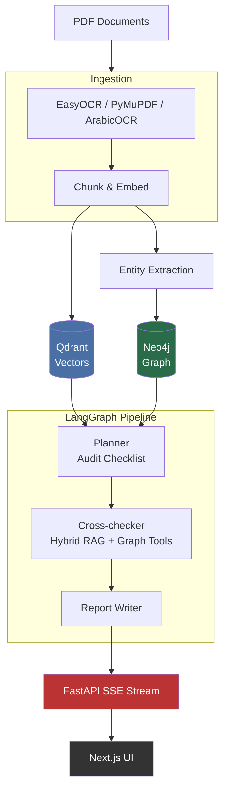

# AuditMind

**Bilingual agentic financial document auditor for Arabic/English workflows**

AuditMind analyzes financial PDFs in Arabic and English, cross-checks them with hybrid RAG (vector + graph), and streams agent reasoning to the UI in real time. It targets Egyptian and MENA use cases with mixed-language documents.

---

## What it does

Upload invoices, contracts, bank statements, or balance sheets (scanned or digital). AuditMind:

1. **Extracts** text — PyMuPDF for digital PDFs; EasyOCR (multilingual) + ArabicOCR fallback for scans  
2. **Embeds** chunks into **Qdrant** (sentence-transformers, 768-dim) and builds an entity graph in **Neo4j**  
3. **Plans** a targeted audit checklist from the detected document types  
4. **Cross-checks** across documents — 4-phase: graph contradiction detection → LLM adjudication → checklist-driven semantic retrieval → deduplication, all orchestrated via a dedicated `cross_checker` package  
5. **Surfaces contradictions** (amount mismatches, date inconsistencies, party discrepancies) with severity and confidence  
6. **Reconciles** contract totals, invoice totals, and bank payments into a snapshot with variance  
7. **Writes** a structured report in Arabic or English  
8. **Streams** every agent reasoning step over **SSE** to the Next.js UI  
9. **Answers questions** about audited documents via retrieval-grounded conversational Q&A  
10. **Supports finding triage** — accept, dismiss, or mark as false positive with persistent signature suppression  

---

## Architecture



**Infra (Docker Compose):** Redis (sessions + reports + chat + triage, 7-day TTL), Qdrant, FastAPI backend, Next.js frontend. **Neo4j** is external (e.g. [Neo4j Aura](https://neo4j.com/cloud/platform/aura-graph-database/)) — configure `NEO4J_*` in `backend/.env`. The audit pipeline runs as a background `asyncio.Task` decoupled from SSE connections.

**Performance:** multi-document uploads are ingested (OCR + embedding) concurrently in a thread pool sized to `os.cpu_count()`. Entity extraction runs per-document in parallel with `asyncio.gather`. Hybrid-RAG query routing and checklist-intent classification are rule-based (no per-item LLM calls). All cross-checker LLM calls use `ainvoke` so they don't block the event loop or SSE keepalives. The audit pipeline runs as a free-standing `asyncio.Task` decoupled from SSE connections — a client disconnect won't cancel the audit.

---

## Tech stack

| Layer | Technology |
|-------|------------|
| Agents | LangGraph 0.2 (`StateGraph`) |
| LLM | [OpenRouter](https://openrouter.ai/) (default) or [Google AI Studio](https://aistudio.google.com/) (Gemini) — set `LLM_PROVIDER` |
| Embeddings | `sentence-transformers/paraphrase-multilingual-mpnet-base-v2` (768-dim, multilingual) |
| OCR | EasyOCR (multilingual), ArabicOCR fallback (Python <3.12), PyMuPDF for digital PDFs |
| Vector DB | Qdrant |
| Graph DB | Neo4j (Aura or self-hosted) |
| Cache / sessions | Redis |
| Backend | FastAPI, SSE, Python 3.11+ |
| Frontend | Next.js 15, React 19, Tailwind CSS, Framer Motion, Radix UI |
| Ops | Docker, Docker Compose |

---

## Prerequisites

- **Python 3.11+** (matches `backend/Dockerfile`)  
- **Node.js 20+**  
- **Docker** with Compose v2 (`docker compose`)  
- **Neo4j** reachable from the backend (Aura free tier works)  
- **OpenRouter API key** — or a **Google AI Studio API key** if you set `LLM_PROVIDER=google`  

---

## Getting started

### 1. Clone and configure the backend

```bash
cd backend
cp .env.example .env
# Edit .env: OPENROUTER_API_KEY (or GOOGLE_API_KEY), NEO4J_URI, NEO4J_USER, NEO4J_PASSWORD, etc.
```

With **Docker Compose**, `QDRANT_URL` and `REDIS_URL` are overridden for the backend container. On your **host**, keep `QDRANT_URL=http://localhost:6333` and `REDIS_URL=redis://localhost:6379` when running Uvicorn outside Compose.

### 2. Run everything with Docker Compose

From the **repository root**:

```bash
docker compose up --build
```

- Frontend: http://localhost:3000  
- Backend API: http://localhost:8000  
- Qdrant dashboard: http://localhost:6333/dashboard  
- Redis: `localhost:6379`  

Ensure `backend/.env` exists (Compose loads it via `env_file`) and Neo4j credentials point to a live database.

### 3. Local development (without rebuilding images)

**Backend**

```bash
cd backend
python -m venv .venv
.venv\Scripts\activate          # Windows
# source .venv/bin/activate     # macOS / Linux
pip install -r requirements.txt
uvicorn app.main:app --reload --host 0.0.0.0 --port 8000
```

Start Redis and Qdrant via `docker compose up redis qdrant` from the repo root, then align `QDRANT_URL` / `REDIS_URL` in `.env`.

**Frontend**

```bash
cd frontend
npm install
npm run dev
```

---

## API

| Endpoint | Method | Description |
|----------|--------|-------------|
| `/health` | GET | Health check (includes Redis reachability) |
| `/api/upload` | POST | Upload PDFs; returns `audit_id` and document metadata |
| `/api/audit/{id}/start` | POST | Start (or resume) background audit pipeline |
| `/api/audit/{id}/stream` | GET | SSE stream of agent events |
| `/api/audit/{id}/report` | GET | Completed audit report (JSON) |
| `/api/audit/{id}/graph` | GET | Knowledge graph (query params: `center_node`, `depth`, `view`) |
| `/api/audit/{id}/status` | GET | Session status and document list |
| `/api/audit/{id}/chat` | GET | Chat history for an audit |
| `/api/audit/{id}/chat` | POST | Ask a question (SSE-streamed retrieval-grounded answer) |
| `/api/audit/{id}/triage` | GET | Triage map (finding_id → verdict) |
| `/api/audit/{id}/findings/{finding_id}/triage` | POST | Triage a finding (accepted / dismissed / false_positive) |
| `/api/audit/{id}` | DELETE | Delete audit + purge Redis/Qdrant/Neo4j data |
| `/api/documents/{doc_id}` | GET | Single document metadata |

### SSE event shapes

Events are JSON objects in SSE `data:` lines. Common `type` values:

**Audit stream (`/api/audit/{id}/stream`):**
- `connected` — session acknowledged; includes `audit_id`, `document_count`  
- `reasoning_step` — agent thought / tool call / tool result / finding  
- `report_ready` — report saved; includes `overall_risk`, `finding_count`  
- `complete` — audit pipeline finished  
- `error` — failure message  

**Chat stream (`POST /api/audit/{id}/chat`):**
- `sources` — retrieved document passages for grounding
- `delta` — answer text chunk
- `done` — response complete
- `error` — failure message  

---

## Configuration (backend)

Settings are loaded from `backend/.env` and validated by `app/config.py` (Pydantic Settings). Key variables:

| Variable | Default | Purpose |
|----------|---------|---------|
| `LLM_PROVIDER` | `openrouter` | `openrouter` or `google` — selects the LLM backend |
| `OPENROUTER_API_KEY` | — | Required when `LLM_PROVIDER=openrouter` |
| `OPENROUTER_BASE_URL` | `https://openrouter.ai/api/v1` | OpenRouter API base URL |
| `OPENROUTER_MODEL` | `openai/gpt-oss-20b:nitro` | General: planner, report writer, document classification, graph-entity extraction |
| `OPENROUTER_MODEL_NER_ARABIC` | `qwen/qwen3-32b` | Entity / NER extraction per chunk — never substituted by `OPENROUTER_MODEL` |
| `OPENROUTER_MODEL_RELATION` | `anthropic/claude-sonnet-4.6` | Cross-checker contradiction adjudication — never substituted by `OPENROUTER_MODEL` |
| `OPENROUTER_REASONING` | `true` | Enables reasoning payload for `OPENROUTER_MODEL` only |
| `GOOGLE_API_KEY` | — | Required when `LLM_PROVIDER=google` |
| `GOOGLE_MODEL` | `gemini-2.5-pro` | General: planner, report, classification, entity extraction |
| `GOOGLE_MODEL_NER_ARABIC` | `gemini-2.5-pro` | Gemini model for NER / entity extraction |
| `GOOGLE_MODEL_RELATION` | `gemini-2.5-pro` | Gemini model for cross-checker / contradiction logic |
| `NEO4J_URI` | `bolt://localhost:7687` | Graph database URI |
| `NEO4J_USER` | `neo4j` | |
| `NEO4J_PASSWORD` | — | |
| `NEO4J_DATABASE` | `neo4j` | |
| `QDRANT_URL` | `http://localhost:6333` | |
| `QDRANT_API_KEY` | — | Required for Qdrant Cloud |
| `QDRANT_COLLECTION` | `auditmind_docs` | Qdrant collection name |
| `REDIS_URL` | `redis://localhost:6379` | Session, report, chat, and triage storage (7-day TTL) |
| `EMBEDDING_MODEL` | `sentence-transformers/paraphrase-multilingual-mpnet-base-v2` | Multilingual sentence embedding model |
| `EXTRACTION_CONCURRENCY` | `3` | Parallel LLM calls inside the entity extractor; reduce to `1` on free-tier rate limits |
| `EXTRACTION_CHUNK_SLEEP` | `0.0` | Seconds to sleep between extraction batches (e.g. `4.0` for free-tier rate limits) |
| `EXTRACTION_TOP_K_BASE` | `50` | Base `top_k` for extraction queries on small docs (≤5 pages) |
| `EXTRACTION_TOP_K_MAX` | `80` | Hard cap on merged chunks passed to entity extraction per document |
| `FINDING_MIN_EVIDENCE_FOR_CRITICAL` | `2` | Minimum evidence snippets required for a critical finding from LLM adjudication |
| `FINDING_MIN_CONFIDENCE_LLM` | `0.65` | Minimum confidence for LLM-adjudicated findings |
| `FINDING_MIN_CONFIDENCE_GRAPH` | `0.55` | Minimum confidence for graph-sourced findings |
| `MAX_UPLOAD_FILE_SIZE_MB` | `20` | Max size (MB) for a single uploaded PDF |
| `MAX_UPLOAD_FILES` | `10` | Max files per upload request |
| `MAX_UPLOAD_PAGES` | `50` | Max pages per uploaded PDF |
| `LLM_TIMEOUT_SECONDS` | `60.0` | Per-request timeout for LLM calls |
| `LLM_MAX_RETRIES` | `2` | Max automatic retries on transient LLM failures |
| `API_KEYS` | — | Comma-separated valid API keys for `/api/*` routes; empty = auth disabled |
| `CORS_ORIGINS` | `http://localhost:3000` | Comma-separated browser origins |

Frontend API base URL: `NEXT_PUBLIC_API_URL` in `frontend/.env.local` (defaults to `http://localhost:8000`).

---


